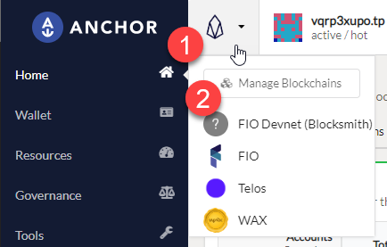
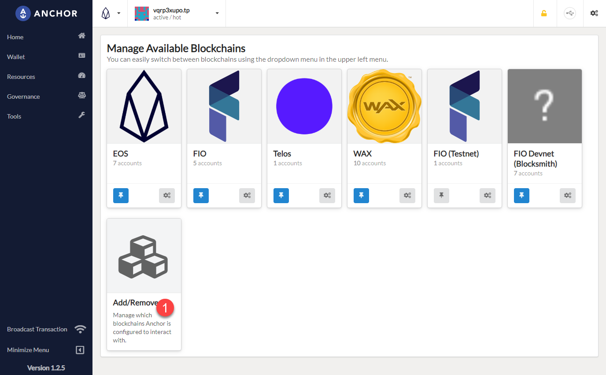
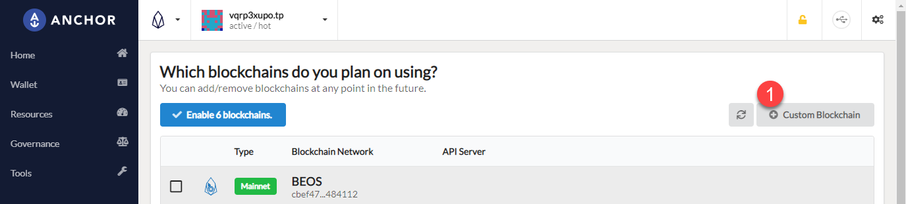
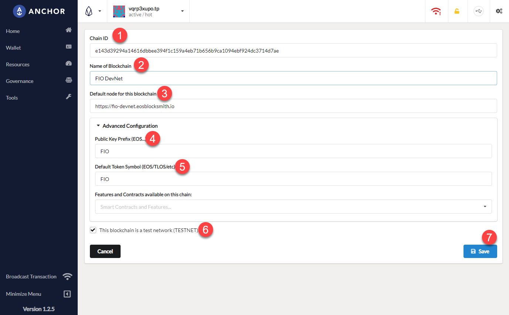
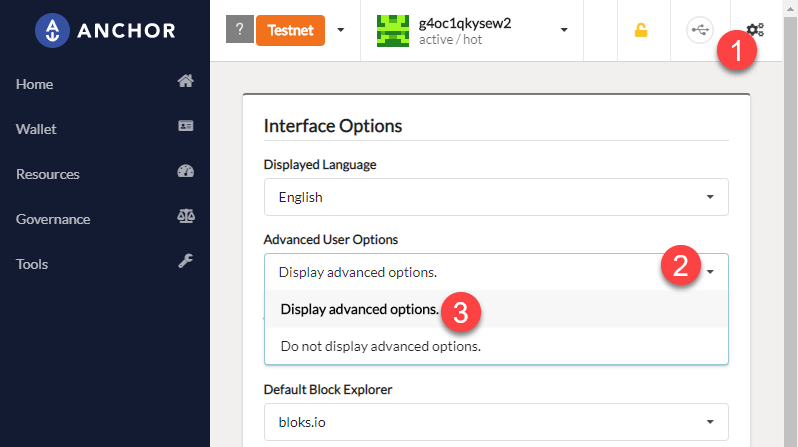
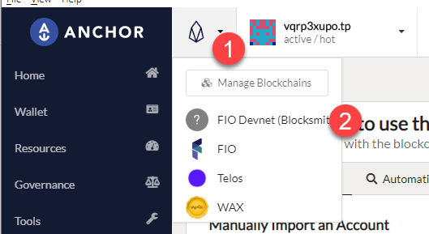
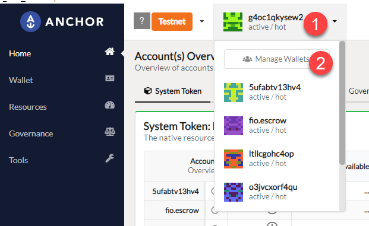
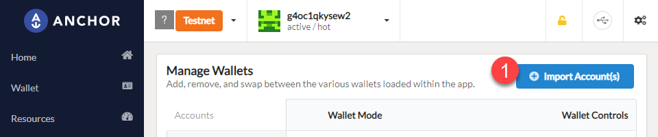
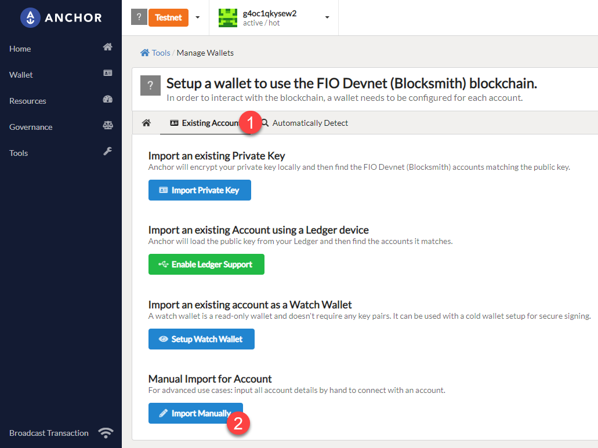
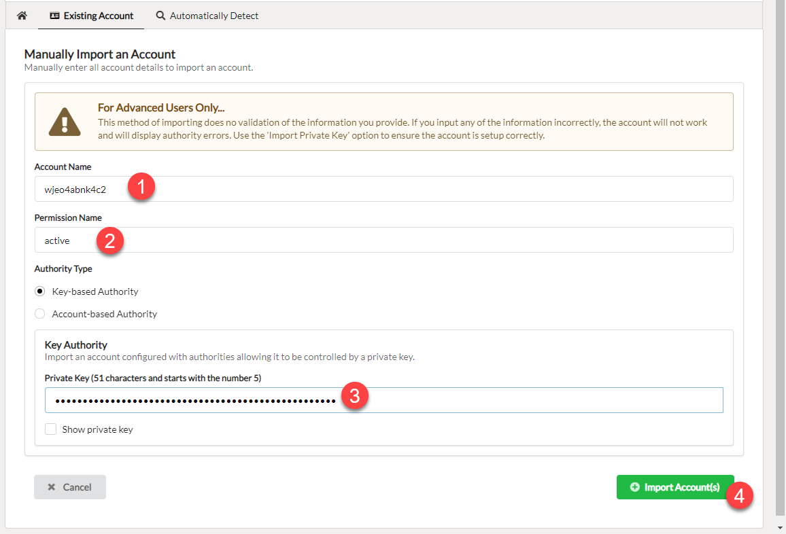

# Anchor Guide

## Manage Blockchain
**Note:** If you don’t have anchor wallet - Download here: https://greymass.com/en/anchor/ - Open application and set up account

Click on the `icon` (#1) next to the Anchor logo and then click `Manage Blockchains` (#2)

Click `Add/Remove` (#1)

Click `+ Custom Blockchain`

(#1) *Chain ID* `e143d39294a14616dbbee394f1c159a4eb71b656b9ca1094ebf924dc3714d7ae`

(#2) *Name of Blockchain* is only for your display purposes, it can be what ever you want `FIO Devnet` seems appropriate though.

(#3) *Default node* is `https://fio-devnet.eosblocksmith.io`

(#4) *Public Key Prefix*: `FIO`

(#5) *Default Token Symbol*: `FIO`

(#6) *This blockchain is a test network*: `Tick the box!`

(#7) Click `Save`

(#1) CLick the gear icon in the top right corner

(#2) Click the drop down for `Advanced User Options`

(#3) Choose `Display advanced options`

Click the EOS Icon (#1) then choose the `FIO Devnet` (#2) (*or what ever you named it*)  
**Note:** If you don’t see it on the drop down - click manage blockchains - click add/remove - select your custom blockchain - click enable blockchain

Click on the account icon (#1) then click *Manage Wallets* (#2)  
**Note:** if you don’t have an account - click set up account (on the left side) - click import an existing account

Click *Import Account(s)* (#1)

Click *Existing Account* (#1) then click *Import Manually* (#2)

### This is done for each account, there are 3

*Account Name:* (#1)`wjeo4abnk4c2`  
*Permission Name:* (#2)`active`    
*Private Key:* (#3)`5J1oyBREGZS4sqRgzofxXP9t7UL2yQgKBZ6MaHF2XzBEfAH3NH4`  
Click `Import Account` (#4)  
Enter local wallet password  
Click authorize

Repeat for other accounts:

Click *Import Account(s)*  
*Account Name:* (#1) `g4oc1qkysew2`  
*Permission Name:* (#2) `active`    
*Private Key:* (#3) `5HwawJrUijKnypZfXrVPqBDTx7nmVCFk5qDG9MRxW7tdPp6bGcM`  
Click `Import Account` ($4)  
Enter local wallet password  
Click authorize

Click *Import Account(s)*  
*Account Name:* (#1) `ltllcgohc4op`  
*Permission Name:* (#2) `active`  
*Private Key:* (#3) `5KAt8KnXaqJSngnY6DKvMmdMfZV6uTZkLQ6kaTRWPzJG6wJV4xo`  
Click `Import Account` (#4)  
Enter local wallet password  
Click authorize  

